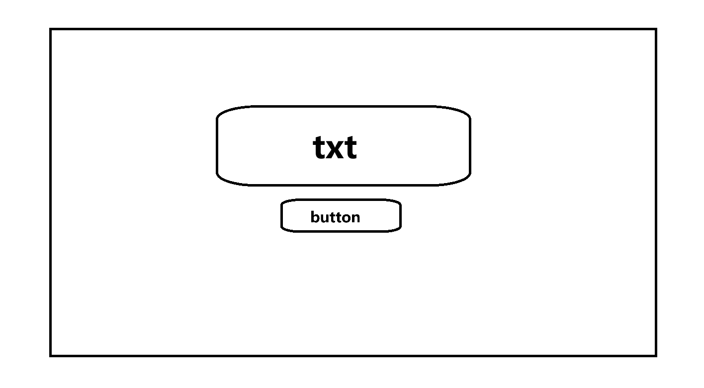
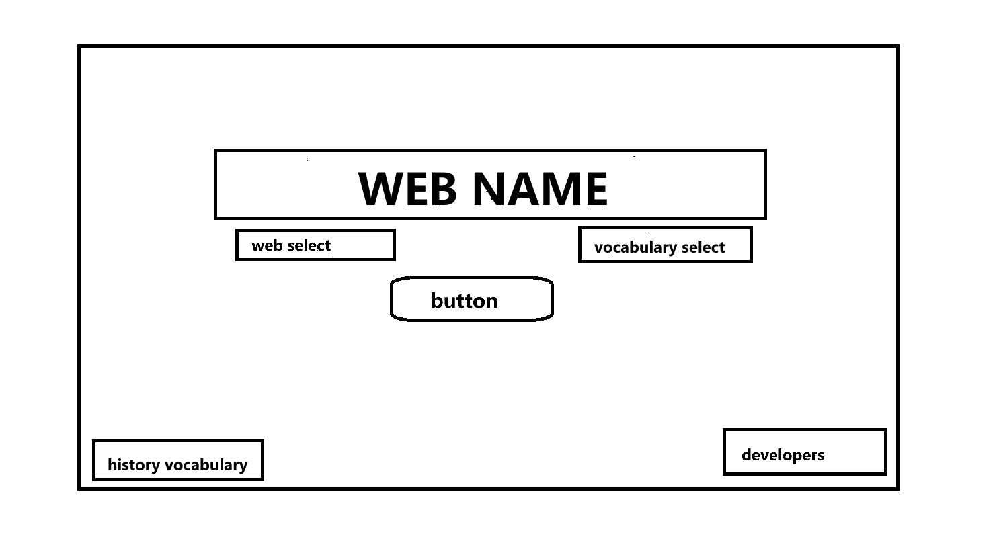
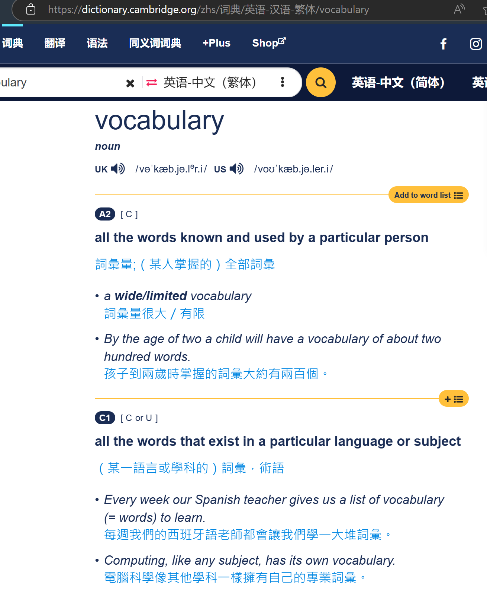
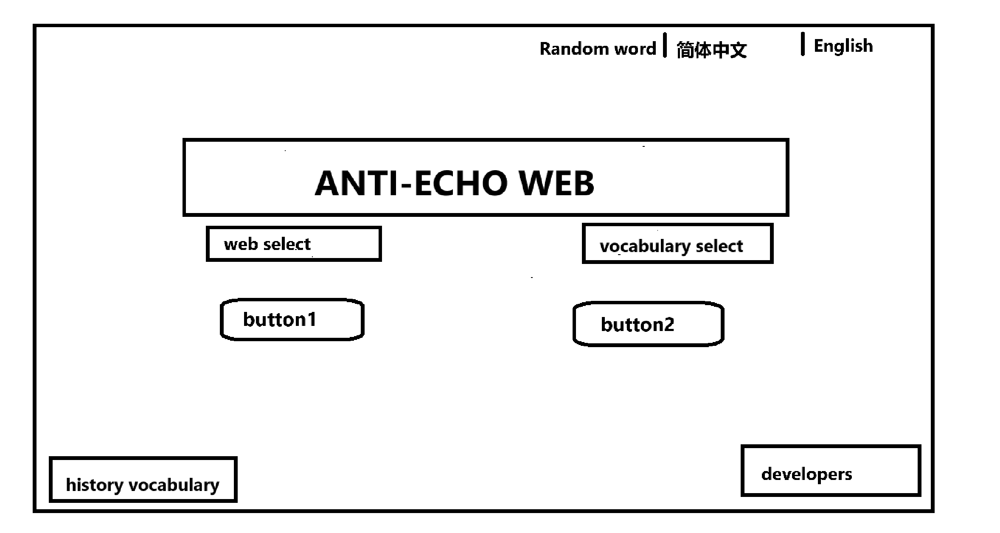
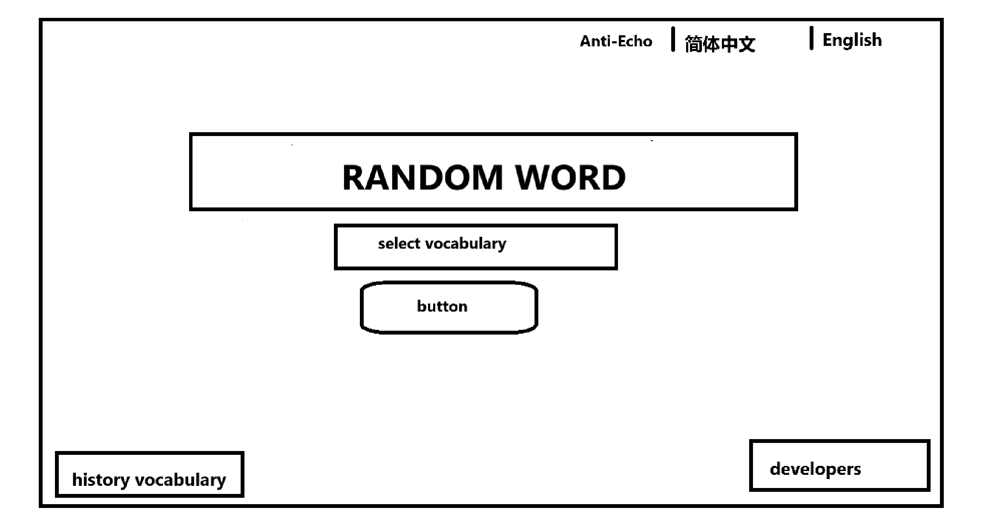

## 工具

#### apifox→ api管理

【21分钟学会Apifox】 https://www.bilibili.com/video/BV1ae4y1y7bf/?share_source=copy_web&vd_source=846247c75ada91a9d78c74d063851407

接口管理

后端debug

#### git→项目管理

【【GeekHour】一小时Git教程】 https://www.bilibili.com/video/BV1HM411377j/?p=11&share_source=copy_web&vd_source=846247c75ada91a9d78c74d063851407

【git分支详解（约10分钟掌握分支80%操作），git-branch，git分支管理，git分支操作，git分支基础和操作，2023年git基础使用教程】 https://www.bilibili.com/video/BV16M411z7uH/?share_source=copy_web&vd_source=846247c75ada91a9d78c74d063851407

对于我们后端是两个人 就可以不通过本地传输文件去通信 同时也可以看到更新日志

前端一个人也可以用这个东西 虽然不需要多人通信 但是也可以看到自己的更新日志

流程

github注册→加入远程仓库→本地仓库创建→关联本地仓库和远程仓库(SSH配置)

```cmd
echo "# Anti-Echo-Web" >> README.md
git init
git add README.md
git commit -m "first commit"
git branch -M main
git remote add origin https://github.com/Painnb/Anti-Echo-Web.git
git push -u origin main
```

使用HTTPS协议

本地修改→上传

云端修改→下载

注意 一般两个人使用git的时候语法和操作不会非常规范 因此如果两个人同时修改了同一个地方的文件会出现一些问题（git会自动识别修改部分来作为日志而非传统意义的覆盖） 因此分工一定会要明确

## 工作

尽量在前几周事少的时候多做一点工作所以在前期还是工作进度细一点快一点

### 前端

##### step1 先进行最基本玩具页面的实现  使用vue 达到基本的输入和返回 能和后端连上 能跑通

​	    一个按钮 放回数据库返回的文本



​	   因为我们没有服务器 所以理论上前端写好 工作流上是要去后端的电脑上去debug

但是由于我们只要确定后端的端口（输入输出）没问题就可以 所以在正常工作流中 前端不需要每次去实验自己的输入输出 只需要确认apifox里面的输入输出没问题就行 后端同样的道理也不需要在网页里面debug 直接用apifox确认自己的输入输出没问题 或者是数据库有无正确的变动就行

##### step2 基本页面



##### step3 UI美化与其他需求

### 后端

后端的debug依赖于apifox

##### step1 玩具功能的实现（已完成）

##### step2 实现跳转目标网页进行搜索而非返回文本   还需要可以选择目标网页 以及已被搜索词汇的保存（放数据库中）

目前的目标网页为（知乎 维基 b站）

目前需要做的事 流程上要善于使用apifox

zyy 将自己的项目建成本地仓库 然后加入我管理的git仓库成员 wjj也加入这个仓库 然后zyy push自己的本地仓库到远程仓库 wjj将这个项目clone到本地 注意分工

如何分工 如果没有内部自己讨论 

那就按照 **zyy写保留被搜索词的部分 wjj写跳转目标网页部分**

wjj的debug要用zyy的电脑实现或者创建一个**完全相同**的数据库


注意工作边界 不要互相修改其他人的工作

##### step3 后续需求和完善和数据库处理

数据库处理部分的工作主要由我来


由于前几周事情少大家尽量多做 因为无论什么时间做总工作量都是一样的 所以早做给后面留足时间

大家尽量在**国庆结束之前**完成step2 完成step2后项目的总工作应该到二分之一左右


实验报告的部分由我来  

项目初具规模后可以web托管（租服务器）这样不管是debug还是规范化都方便

数据库处理方面主要由我但是如果时间不够可能需要所有人帮助


任何技术不会都可以在群里讨论或者问csdn gpt stackoverflow
语法有问题不会是任何问题 gpt可以轻易的帮你完成语法部分的内容 主要是逻辑清晰 善用搜索 多讨论 

10月11日 随机一词功能及语言切换

在做什么？

增加一个随机跳转到词典网页如



允许用户自行选择如四六级词库 雅思词库等

实现类似于每日一词的功能

前端

页面 A



页面 B



其中要求停留在中文界面时 英文选项可以点击 而中文选项不可点击 英文界面同样如此


后端

增加词汇数据库 只需要词汇本身和序号 

词库可以自行找网页搜索

要求建立四级词库 六级词库 雅思词库 托福词库

注意

random word 和anti-echo 的历史词应该分开


**部署服务器：**

利用宝塔将程序部署到服务器上 然后长期挂载在服务器上

具体而言：

需要先把将 Spring Boot 项目打包为一个可执行的 `jar` 文件。通常使用 Maven 或 Gradle 打包命令。

Vue 项目需要通过构建工具（如 `npm` 或 `yarn`）进行构建生成静态资源文件。

将打包后的后端和前端资源传输到服务器

安装数据库

安装nginx做反向代理

springboot支持远程调试 可以直接用ide连接服务器进行调试程序

前端可以现在本地利用服务器的api开发 后完全开发完成后将文件夹打包上传至服务器即可

具体概念自行学习 

宝塔面板权限将在后面给大家